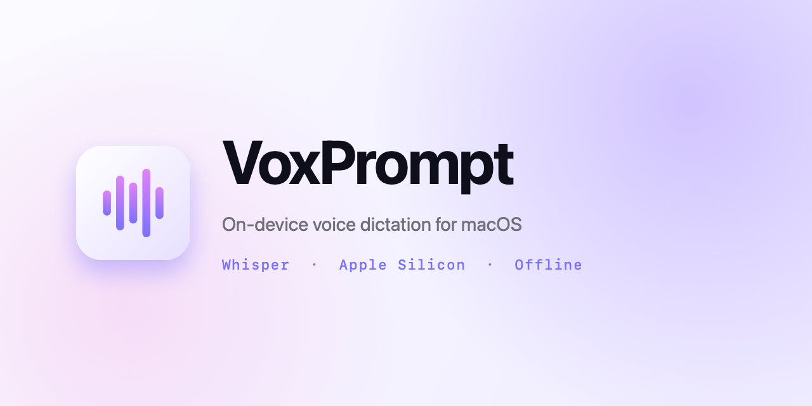

<p align="center">
  
</p>

<p align="center">
  <strong>Hold a key, speak, release.</strong><br/>
  On-device voice dictation for macOS, powered by Whisper running on the Apple Neural Engine.<br/>
  Fully offline. Private. Free. A lightweight alternative to Superwhisper.
</p>

<p align="center">
  
  
  
  
</p>

<p align="center">
  <a href="#install">Install</a> ·
  <a href="#features">Features</a> ·
  <a href="#how-it-works">How it works</a> ·
  <a href="README.fr.md">Français</a>
</p>

---

## Why VoxPrompt

Typing is slow. Dictation tools usually send your audio to the cloud or cost a subscription. VoxPrompt runs Whisper **100 % on your Mac**. Your voice never leaves the device. It's fast (one-second latency on Apple Silicon) and free.

## Features

- **On-device transcription** with WhisperKit on the Apple Neural Engine
- **Press-and-hold global hotkey** (Right Option by default, fully configurable)
- **Live waveform HUD** while you're speaking
- **Custom glossary** with Levenshtein fuzzy-match for proper nouns, brand names, and technical jargon
- **Menu bar popover** with a clean light theme, no separate window clutter
- **Multilingual** (auto-detect French / English, or force a language)
- **Zero telemetry**, zero tracking, zero analytics

## Install

### Option 1 — Download the DMG
Grab the latest release from [GitHub Releases](https://github.com/charlesneveu/voxprompt/releases), open the DMG, drag `VoxPrompt.app` into `/Applications`.

### Option 2 — Build from source
```bash
git clone https://github.com/charlesneveu/voxprompt.git
cd voxprompt
./setup-signing.sh   # one-time: creates a persistent signing identity (see below)
./build.sh
open build/VoxPrompt.app
```

## How it works

1. **Press and hold** your configured key. A HUD appears at the bottom of the screen with a live waveform.
2. **Speak** naturally. Audio is captured at 16 kHz mono.
3. **Release**. Whisper transcribes on the Neural Engine (~1 second for a 5-second utterance with the default turbo model). The text is pasted where your cursor is.

The first run downloads the Whisper model automatically (~632 MB from HuggingFace). It's cached for all subsequent runs.

## Permissions

| Permission | Why |
|------------|-----|
| Microphone | Capture your voice |
| Accessibility | Detect the global hotkey, simulate ⌘V to paste |

macOS will prompt you on first use. Accept both, and you're set.

## Whisper models

| Model | Size | Latency | Quality |
|-------|------|---------|---------|
| **Large v3 Turbo** (default) | 632 MB | ~1 s | Excellent, multilingual |
| Large v3 | 626 MB | ~2 s | Maximum |
| Base | 74 MB | instant | Fair |
| Tiny | 39 MB | instant | Testing only |

Switch models from the menu bar popover → Preferences.

## Glossary

Proper nouns are Whisper's weak spot. VoxPrompt lets you add a list of words in **Preferences → Glossary**. After each transcription, every word is compared against your glossary using Levenshtein distance. Close phonetic matches are replaced.

```
Glossary: Gandy, Kwanko, Shopify

"I meet Gandhi tomorrow"  →  "I meet Gandy tomorrow"
"Send it to Shopi"        →  "Send it to Shopify"
```

## Persistent signing (recommended for devs)

By default macOS invalidates Accessibility permission on every rebuild because the ad-hoc signature changes. If you're building from source, run once:

```bash
./setup-signing.sh
```

It generates a stable self-signed "VoxPrompt Developer" code signing identity in your login keychain. Every build will use it, and Accessibility permission persists across rebuilds.

## Debug logging

Disabled by default. To enable:
```bash
launchctl setenv VOXPROMPT_DEBUG 1
```
Logs go to `~/Library/Logs/VoxPrompt/voxprompt.log` (mode `0600`, user-only).

## Tech stack

- Swift 5.10 · SwiftUI · AppKit
- [WhisperKit](https://github.com/argmaxinc/argmax-oss-swift) (CoreML + MLX)
- AVFoundation for 16 kHz mono audio capture
- `NSEvent.addGlobalMonitorForEvents` for the global hotkey
- `NSPasteboard` + `CGEvent` for paste

## Privacy

- **100 % on-device**: audio, transcription, clipboard. Nothing is sent anywhere.
- Only network call: one-time download of the Whisper model weights from HuggingFace.
- No telemetry. No analytics. No third-party SDKs.

## Roadmap

- [ ] Live waveform linked to microphone level (instead of simulated)
- [ ] Custom hotkey capture (any key combo)
- [ ] Launch at login
- [ ] Menu bar icon customisation
- [ ] Streaming transcription (partial results while speaking)

Contributions welcome. Open an issue or a PR.

## License

[MIT](LICENSE) · Copyright © 2026 Charles Neveu
