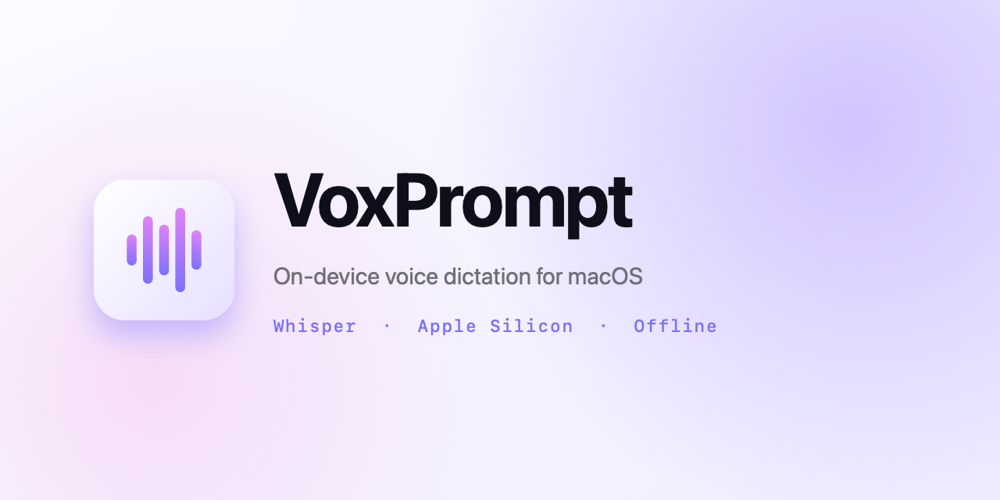

<p align="center">
  
</p>

<h1 align="center">VoxPrompt</h1>

<p align="center">
  <strong>Hold a key, speak, release.</strong><br/>
  The fastest <strong>offline voice-to-text</strong> app for macOS.<br/>
  Powered by Whisper on the Apple Neural Engine. Private. Free. Open-source.
</p>

<p align="center">
  <a href="https://github.com/charle-com/voxprompt/releases/latest"></a>
  
  
  
  
  
</p>

<p align="center">
  <a href="#install"><strong>Install</strong></a> ·
  <a href="#features">Features</a> ·
  <a href="#how-it-works">How it works</a> ·
  <a href="#troubleshooting">Troubleshooting</a> ·
  <a href="#faq">FAQ</a> ·
  <a href="README.fr.md">Français</a>
</p>

---

## What is VoxPrompt?

**VoxPrompt is a free, open-source macOS voice dictation app that runs entirely on your Mac.** Hold a key, speak, release: the text is transcribed by [Whisper](https://openai.com/research/whisper) on the Apple Neural Engine and pasted into any app. No cloud, no subscription, no account. A lightweight open-source alternative to Superwhisper, Aiko, and MacWhisper.

- **Offline** · audio never leaves your Mac
- **Fast** · transcription runs while you speak, so the text lands about a second after you release the key
- **Private** · zero telemetry, zero tracking
- **Free** · MIT licensed, no paywall

## Install

### One command (recommended)

```bash
curl -fsSL https://raw.githubusercontent.com/charle-com/voxprompt/main/install.sh | bash
```

Downloads the latest release, verifies its code signature against the project certificate, installs it into `/Applications`, and launches it. No `sudo`, nothing else is touched. [Read the script first](install.sh) if you prefer, it is 150 lines of plain bash.

This route also avoids the Gatekeeper prompt described below, because a file fetched with `curl` is not quarantined.

### Download the DMG

Grab it from the [latest release](https://github.com/charle-com/voxprompt/releases/latest), open it, and drag `VoxPrompt.app` into `/Applications`.

macOS will refuse the first launch: VoxPrompt is signed, but not notarized by Apple (notarization requires a paid developer account, this project has none). To allow it, open **System Settings > Privacy & Security**, scroll to the message about VoxPrompt, and click **Open Anyway**. You only ever do this once.

### Build from source

```bash
git clone https://github.com/charle-com/voxprompt.git
cd voxprompt
./setup-signing.sh    # one-time, creates a persistent code signing identity
./build.sh --install  # builds, verifies the signature, installs into /Applications
```

Requires the full Xcode (WhisperKit and MLX do not build with Command Line Tools alone).

## Features

- 🎙️ **On-device voice transcription** via WhisperKit on the Apple Neural Engine
- ⚡ **Streaming transcription**: sentences are transcribed while you are still speaking, so releasing the key returns the text almost immediately
- ⌨️ **Global press-and-hold hotkey** (Right Option by default, configurable)
- 〰️ **Live waveform HUD** driven by the real microphone signal
- 🎚️ **Explicit microphone selection**, so a Bluetooth headset connecting mid-session cannot hijack your input
- 📚 **Custom glossary** with fuzzy matching for proper nouns, brand names, and technical jargon
- 🩺 **Permission dashboard** in Preferences: live status for Microphone, Accessibility, and Automation, with a one-click repair path
- 🌍 **Multilingual**, all 99 Whisper languages, auto-detect or forced
- 📝 **Reliable auto-paste** into the focused app, with an automatic fallback chain for apps that reject synthetic keystrokes
- 🧠 **Swappable Whisper models**, from 39 MB Tiny to 632 MB Large v3 Turbo
- 🔕 **Nothing running when idle**: no audio device is held open until you actually press the key

## How it works

1. **Press and hold** your configured key. A HUD appears at the bottom of the screen with a live waveform.
2. **Speak** naturally. Audio is captured at 16 kHz mono and split on natural pauses; each chunk is transcribed in the background while you keep talking.
3. **Release**. Only the last sentence remains to transcribe. The text is pasted where your cursor is.

On the first run the Whisper model weights (632 MB for the default model) are downloaded once from HuggingFace, with progress shown in the HUD. Every subsequent run loads from the local cache.

## Permissions

| Permission | Required | Why |
|------------|----------|-----|
| **Microphone** | Yes | Capture your voice during dictation. macOS asks on first launch. |
| **Accessibility** | Yes | Detect the global hotkey and paste the transcript. Grant it in System Settings, macOS cannot prompt for this one. |
| **Automation** | Optional | Only used as a paste fallback for apps that ignore synthetic key events. macOS asks the first time it is needed. |

Preferences shows the live state of all three and links straight to the right settings pane. Everything is handled by native macOS APIs, no third-party SDK ever sees your audio or text.

## Troubleshooting

### The hotkey does nothing

Accessibility is not granted, or was silently revoked. Open **Preferences > Accessibility** in VoxPrompt: the status is shown live. If macOS shows VoxPrompt as already enabled but nothing happens, toggle it off and on again, or run:

```bash
tccutil reset Accessibility fr.charlesneveu.voxprompt
```

then relaunch VoxPrompt and grant it again.

### The HUD says "no sound" even though I spoke

Check the microphone selected in **Preferences > Microphone**. If you build from source, also make sure the app is signed with the bundled entitlements file: under the hardened runtime, macOS silently feeds an app zero-filled audio when `com.apple.security.device.audio-input` is missing. `./build.sh` verifies this before finishing, and refuses to produce an unusable bundle.

### The text lands in the clipboard instead of the app

Some apps reject synthetic key events. VoxPrompt falls back to AppleScript, which needs the Automation permission the first time. If the target app still refuses, switch **Preferences > Paste** to `AppleScript only`, and press ⌘V yourself if all else fails: the transcript is always in your clipboard.

### Transcription is slow, or hangs

macOS 26.5.x has a CoreML bug that deadlocks Whisper inference on the Neural Engine and the GPU. VoxPrompt probes the available compute backends at startup, remembers the fastest one that actually works for your exact macOS build, and re-tests automatically once Apple ships a fix. A stuck decode is abandoned by a watchdog rather than spinning forever. To force a fresh probe:

```bash
defaults delete fr.charlesneveu.voxprompt whisper.computeProfile
```

### Nothing works after moving the app

If the app runs from a quarantined location it is executed from a read-only temporary volume, which breaks its permissions. Reinstall with the one-line installer, or run `xattr -cr /Applications/VoxPrompt.app`.

## Whisper models

VoxPrompt uses [WhisperKit](https://github.com/argmaxinc/argmax-oss-swift) by Argmax, which runs Whisper models on the Apple Neural Engine via CoreML. Models come from [`argmaxinc/whisperkit-coreml`](https://huggingface.co/argmaxinc/whisperkit-coreml) on HuggingFace.

| Model | Size | Quality |
|-------|------|---------|
| **Large v3 Turbo** (default) | 632 MB | Excellent, multilingual |
| Large v3 | 626 MB | Maximum |
| Base | 74 MB | Fair |
| Tiny | 39 MB | Testing only |

Switch models from the menu bar popover, then Preferences. The new model downloads on first use, with progress in the HUD.

## Glossary, fixing Whisper's weak spot

Whisper is excellent at general speech but struggles with proper nouns (client names, brands, technical terms). VoxPrompt solves this with a local glossary.

Add words in **Preferences > Glossary** (comma or newline separated). After each transcription, every word in the output is compared to your glossary. Close phonetic matches are replaced with the correct spelling and casing, while words that are already valid are left alone.

```
Glossary: Gandy, Kwanko, Shopify, Klaviyo

Whisper hears       ->  VoxPrompt outputs
"I meet Gandhi"     ->  "I meet Gandy"
"send to Shopi"     ->  "send to Shopify"
"call with Kwanko"  ->  "call with Kwanko"  (already correct, kept)
```

## Code signing and updates

VoxPrompt is signed with a stable self-signed identity, which is what lets macOS keep your Accessibility grant across updates. It is deliberately **not** notarized: notarization requires a paid Apple Developer account, and this project has none.

Update checking is **off by default**. Enable it in Preferences and VoxPrompt will ask GitHub once a day whether a newer release exists, then simply open the release page. No automatic download, no background installer, nothing sent beyond the request itself.

If you build from source, run `./setup-signing.sh` once. It creates the persistent "VoxPrompt Developer" identity in your login keychain, so rebuilds keep their permissions instead of being treated as a brand new app every time.

## Debug logging

Disabled by default to protect privacy (transcribed text can contain sensitive data). Enable for troubleshooting:

```bash
launchctl setenv VOXPROMPT_DEBUG 1
```

Logs are written to `~/Library/Logs/VoxPrompt/voxprompt.log` with mode `0600` (user-only).

## Tech stack

- **Swift 5.10**, SwiftUI, AppKit
- **[WhisperKit](https://github.com/argmaxinc/argmax-oss-swift)**, Whisper on CoreML and MLX
- **AudioUnit HAL**, input-only capture on an explicitly selected device
- **NSEvent monitors**, global press-and-hold hotkey
- **NSPasteboard** and **CGEvent**, paste into the active app

## Privacy

VoxPrompt is built around one simple promise: **your voice never leaves your Mac.**

- 100 % on-device transcription
- No cloud API, no server, no telemetry
- Network is touched exactly twice, both under your control: downloading the model weights on first use, and the optional update check you have to enable yourself
- No third-party SDKs, no analytics, no crash reporters

See [PRIVACY.md](PRIVACY.md) for a detailed breakdown.

## FAQ

### Is VoxPrompt really free?
Yes. MIT licensed, no paywall, no upsell, no freemium.

### How does it compare to Superwhisper, Aiko, or MacWhisper?
Similar on-device approach, similar Whisper backend. VoxPrompt is fully open-source and MIT licensed.

### Why does macOS say the app cannot be verified?
Because it is not notarized, which requires a paid Apple Developer account. The app is signed, and the installer verifies that signature against the project certificate before copying anything. Use the one-line installer to skip the warning entirely.

### Does it work without an internet connection?
After the initial model download, yes, fully offline.

### Which languages are supported?
All 99 languages supported by Whisper. The default model auto-detects; you can force one in Preferences.

### Does it run on Intel Macs?
No. VoxPrompt requires Apple Silicon (M1 and later) because WhisperKit runs on the Apple Neural Engine.

### Can I use VoxPrompt in any app?
Yes. VoxPrompt pastes into whichever app has focus: text editors, browsers, Slack, messaging apps, terminals, and so on.

### Is the audio stored anywhere?
No. Audio goes to a temporary WAV file, gets transcribed, and is deleted immediately afterwards.

### Does it keep my microphone open in the background?
No. No audio device is opened until you press the hotkey, and everything is released as soon as you let go.

## Roadmap

- [x] Live waveform driven by microphone input (shipped in v1.0.0)
- [x] Streaming transcription, partial results while speaking (shipped in v0.2.0)
- [x] Launch at login (shipped in v0.1.2)
- [x] Paste mode picker (shipped in v0.1.1)
- [x] Microphone picker and permission dashboard (shipped in v1.0.0)
- [ ] Custom hotkey capture (any key combo)
- [ ] Menu bar icon customisation
- [ ] Localised UI (EN / FR / ES / DE)

Contributions welcome, open an issue or a PR.

## Related projects

- [WhisperKit](https://github.com/argmaxinc/argmax-oss-swift), the Swift library that makes on-device Whisper possible (used under the hood)
- [Whisper](https://github.com/openai/whisper), OpenAI's original speech recognition model
- [Superwhisper](https://superwhisper.com), excellent paid alternative
- [Aiko](https://sindresorhus.com/aiko), free local Whisper transcription for audio files

## License

[MIT](LICENSE) · Copyright © 2026 Charles Neveu

---

<p align="center">
  <sub>Built with ♥ on Apple Silicon. Star ⭐ if you find it useful!</sub>
</p>
